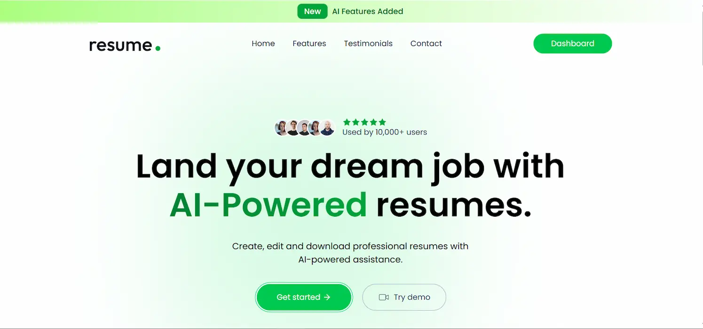
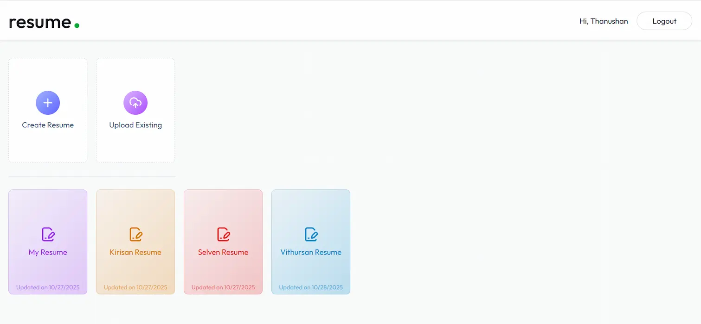
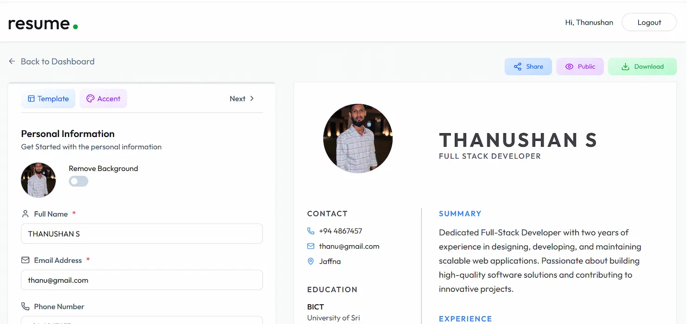
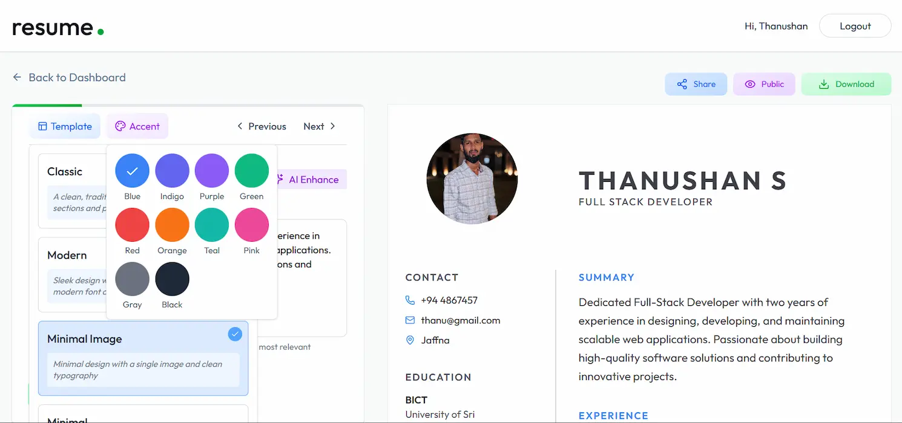

# AI Resume Builder

A full-stack resume builder with AI-enhanced content generation. Build, edit, and share professional resumes using AI prompts (OpenAI), image tools, and a modern React editor.

## Table of Contents

- [Features](#features)
- [Screenshots](#screenshots)
- [Project Structure](#project-structure)
- [Getting Started](#getting-started)
- [Usage](#usage)
- [Contributing](#contributing)

## Features

- Create, edit and save multiple resume templates.
- AI-enhanced professional summary and job description generation.
- Upload and preview profile images (optional background removal via ImageKit).
- Public resume preview and shareable links.
- Authentication with JWT and persisted session.
- Client-side resume preview and print/download.
- Responsive UI and multiple templates (Classic, Modern, Minimal, Minimal with Image).

## Screenshots

<p align="center">
  
  
  
  
   
</p>

## Project Structure

```
├── client
│   ├── public
│   │   ├── favicon.ico
│   │   └── logo.svg
│   ├── src
│   │   ├── app
│   │   │   ├── Features
│   │   │   │   └── authSlice.js
│   │   │   └── store.js
│   │   ├── assets
│   │   │   ├── assets.js
│   │   │   └── dummy_profile.png
│   │   ├── componetns
│   │   │   ├── Home
│   │   │   │   ├── Banner.jsx
│   │   │   │   ├── CallToAction.jsx
│   │   │   │   ├── Features.jsx
│   │   │   │   ├── Footer.jsx
│   │   │   │   ├── Hero.jsx
│   │   │   │   ├── Testimonial.jsx
│   │   │   │   └── Title.jsx
│   │   │   ├── templates
│   │   │   │   ├── ClassicTemplate.jsx
│   │   │   │   ├── MinimalImageTemplate.jsx
│   │   │   │   ├── MinimalTemplate.jsx
│   │   │   │   └── ModernTemplate.jsx
│   │   │   ├── ColorPicker.jsx
│   │   │   ├── EducationForm.jsx
│   │   │   ├── ExperienceForm.jsx
│   │   │   ├── Loader.jsx
│   │   │   ├── Navbar.jsx
│   │   │   ├── PersonalInfoForm.jsx
│   │   │   ├── ProfessionalSummary.jsx
│   │   │   ├── ProjectForm.jsx
│   │   │   ├── ResumePreview.jsx
│   │   │   ├── SkillsForm.jsx
│   │   │   └── TemplateSelector.jsx
│   │   ├── configs
│   │   │   └── api.js
│   │   ├── pages
│   │   │   ├── Dashboard.jsx
│   │   │   ├── Home.jsx
│   │   │   ├── Layout.jsx
│   │   │   ├── Login.jsx
│   │   │   ├── Preview.jsx
│   │   │   └── ResumeBuilder.jsx
│   │   ├── App.jsx
│   │   ├── index.css
│   │   └── main.jsx
│   ├── .env copy
│   ├── .gitignore
│   ├── eslint.config.js
│   ├── index.html
│   ├── package-lock.json
│   ├── package.json
│   ├── vercel.json
│   └── vite.config.js
│
│
│
│
├── server
│   ├── configs
│   │   ├── ai.js
│   │   ├── db.js
│   │   ├── imageKit.js
│   │   └── multer.js
│   ├── controllers
│   │   ├── aiController.js
│   │   ├── resumeController.js
│   │   └── userController.js
│   ├── middlewares
│   │   └── authMiddleWare.js
│   ├── models
│   │   ├── Resume.js
│   │   └── User.js
│   ├── routes
│   │   ├── aiRoutes.js
│   │   ├── resumeRoutes.js
│   │   └── userRoutes.js
│   ├── .env copy
│   ├── .gitignore
│   ├── package-lock.json
│   ├── package.json
│   ├── server.js
│   └── vercel.json
└── README.md
```

## Getting Started

Prerequisites:

- Node.js & npm
- MongoDB (local or cloud)
- OpenAI API key
- (Optional) ImageKit key for image background removal

Clone and run locally:

Server

```bash
cd server
npm install
# create .env with required variables (see .envcopy)
npm run server
```

Client

```bash
cd client
npm install
# create .env with required variables (see .envcopy)
npm run dev
```

Open the client in your browser (Vite prints the local URL). The server runs on the configured PORT (defaults to 3000).

## Usage

- Sign up / login (client persists token in localStorage).
- Create or open a resume in Dashboard → Builder.
- Use AI buttons to enhance summary or experience lines.
- Save changes, toggle public/private, and share or print the resume (print triggers download).
- Public resumes are viewable via /view/:resumeId (Preview page).

## Troubleshooting

- If AI calls fail, verify API_KEY and OPENAI_MODEL in server env and that [server/configs/ai.js](server/configs/ai.js) is configured.
- If DB fails, confirm MONGO_URI and check [`mongoConnect`](server/configs/db.js) logs.
- CORS issues: ensure CLIENT_URL is set or server allowed origin is configured in [server/server.js](server/server.js).

## Contributing

- Open issues for bugs or feature requests.
- Follow code style in ESLint config: [client/eslint.config.js](client/eslint.config.js).
- Tests: (not included) add unit tests and run from package scripts.

© 2025 AI Resume Builder. Powered by [S.Thanushan.](https://thanushan-dev.vercel.app/)
